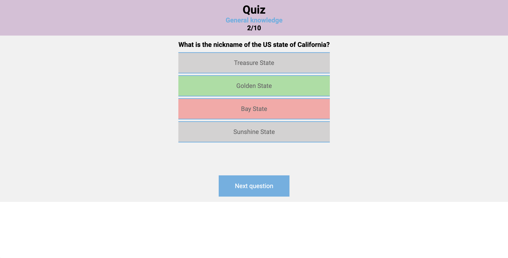

# Project Name

> Wanderlust

## Table of contents

- [General info](#general-info)
- [Screenshots](#screenshots)
- [Technologies](#technologies)
- [Setup](#setup)
- [Features](#features)
- [Status](#status)
- [Contact](#contact)

## General info

Quiz game undertaken during Strive School's Full Stack Developer Course.

## Screenshots

## Technologies

- JavaScript
- CSS
- HTML
- Open Trivia DB

## Setup

- [Live Demo](https://brandaspt.github.io/M1Benchmark/)
- [Source Code](https://github.com/brandaspt/M1Benchmark)

## Features

- DOM Manipulation
- HTTP Requests
- Async await

## Status

Project is: _in progress_.

To Do:

- Choose number of questions
- Choose difficulty
- Show overall answer accuracy

## Contact

Created by [@Tiago Brandao](https://www.imtiago.world/) - feel free to contact me!
